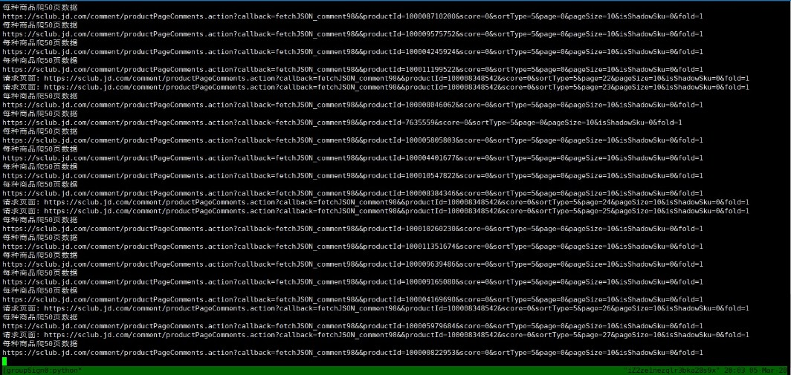

# 使用说明

### 数据集部分

数据集在data目录下，里面包含了测试集数据[tmp_test_data.csv](data/tmp_test_data.csv)，大约有5000条评论数据，共11款手机，便于演示。同时也包含了完整的数据集[JDComment_data](data/JDComment_data.csv)，大约2，包含进60款手机的评论数据。[test_result.csv](data/test_result.csv) 是采用完整数据集计算出的各个手机的评论得分，可以用做功能演示。

### 评论数据采集

除了已经采集好的数据集，也可以通过脚本SpiderScript重新爬取

在安装好Python，以及配置好pip或conda环境之后，在[当前位置打开cmd控制台](<https://blog.csdn.net/yanlaifan/article/details/80434793>)(windows)或者在终端输入(Linux)以下语句执行脚本

`python SpiderScript.py`

正常执行界面如下图所示，采集完成之后保存到路径data/JDComment_data中

**注意！**：保存的JDComment_data文件格式为`utf-8-sig`，需要打开后重新保存一下，转换成`utf-8`就可以正常操作了

### 评论数据情感分析并计算得分

tmp.py和comment_analysis_process都是计算情感分析的python源码，区别只是在于文件格式不同而已，可以根据不同的环境采用不同的脚本。

tmp.py运行方式为在控制台输入`python tmp.py`

同时也可以使用`python tmp.py -h`查看并修改默认参数，示例如下(指定密码为1)

comment_analysis_process可以用jupyter notebook或其他ipython IDE打开执行，内容同tmp.py一样

执行之后会将相同手机的评论整合到同一个TXT文件中，以手机名称命名，在input目录下。同时也能自动读取这些文件对其处理求评论得分，包含评论得分的完整手机信息默认存储在[data/result.cscv](data/result.cscv)目录下。

### 关于数据库存储

在配置好本地机器Mysql环境之后，在控制台进行测试，详见[mysql配置环境变量（win 10）](<https://blog.csdn.net/li93675/article/details/80700152>) 。tmp.py脚本执行后，会自动保存到数据库jd_comment中（存储result.csv表）

### 页面测试

双击打开目录下的index.html，上传data目录下的result数据集进行测试即可，只能在本地演示。演示效果如下图

### 版本控制

为了便于管理和维护，我已将项目提交到[<https://github.com/YuleZhang/NLP_Analysis_JDcomment>](<https://github.com/YuleZhang/NLP_Analysis_JDcomment>)，可以自行下载查阅。

### 部分参考

[python实现多线程爬虫](<https://blog.csdn.net/qq_36063562/article/details/92834143>)

[MySQL的python连接](<https://www.runoob.com/python3/python3-mysql.html>)

[用python实现文本情感分析](<https://www.jianshu.com/p/58bfd9e53db0?t=123>)

[optparse模块](<https://www.jianshu.com/p/35ec031af6e3>)